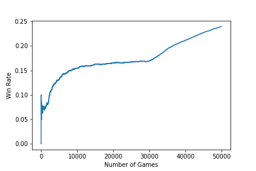
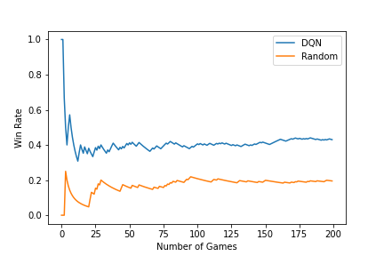
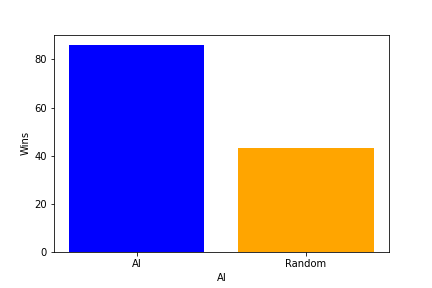
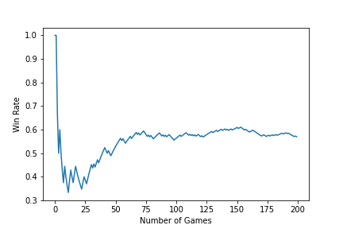
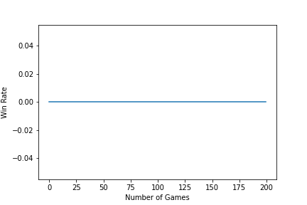

```{r setup, include=FALSE}
knitr::opts_chunk$set(echo = TRUE)
knitr::opts_chunk$set(fig.pos = 'h')
```

\makeatletter\renewcommand*{\fps@figure}{H}\makeatother

\doublespacing

## 1. Introduction

Artificial neural networks are usually trained only on a very specific task: playing poker, protein folding, or driving a car. While these tasks have many different sub-problems, the end goal is to solve a very distinct task. When neural networks are trained on new tasks, they will forget their old task, called catastrophic forgetting [@catastrophicforgetting]. However, real intelligent beings can learn multiple tasks and excel at each task, they don't forget previous tasks. When a person learns how to play the guitar, they don't forget how to play the piano. Therefore, it is an important goal for neural networks to be able to solve multiple tasks.

The goal of this paper is to train a multitask/ "general" card-solving neural network. Specifically, the goal is to train a neural network to play both blackjack and 2-card poker and then compare the results to neural networks trained only to play only blackjack or poker.

Blackjack and poker are two very popular card games played with a standard 52-card deck. The goal of blackjack is to get the value of your hand as close to 21 without going over. If you go over 21, you automatically lose. Initially, the player is given 2 cards but you can hit, or draw a card, as many times as you want. The version of blackjack used in this paper is modified. The deck contains no face-up cards and instead of typically having a value of 1 or 11, the ace has only a value of 1; therefore, the deck only contains only cards. Poker is a card game in which a player is given cards and attempts to make the best hand with a bridge, cards available to all players. Then bets against other players to see who has the best hand. 2-card poker is a version of poker in which there are no rounds, the player has to make a bet based on his 2 cards and the bridge. The deck used for 2-card poker will be the same as the deck used for blackjack.

As Blackjack and poker are two very popular card games, there have been papers and projects that have trained neural networks to play these card games [@rlearning]. However, there has not been much research on training neural networks to play multiple card games or, in general, training a neural network to be good at multiple different tasks. This paper will be an attempt to train a neural network to be good at poker and blackjack using a method called elastic weight consolidation (EWC for short) that first appeared in a 2016 DeepMind paper titled "Overcoming catastrophic forgetting in neural networks" [@catastrophicforgetting].

## 2. Data

All data from this paper currently is generated from the program files proved in the repository for this paper. The neural network used to approximate the Q-function is 2 layers neural network. The Blackjack deep Q-Network (DQN) is trained against a conservative blackjack "ai" that only hits if its hand value is less than 15. The model is trained by playing 50000 rounds. The model took 3 hours and 22 minutes to be trained. After the DQN is trained, it competes against the conservative blackjack "ai" for 200 rounds. And the results are then compared to those of a random blackjack "ai". The random blackjack "ai" has a 50% percent chance of hitting or folding. Then the DQN faces off against the random "ai" directly and then finally faces off against another trained DQN.

The code for training a DQN model to play 2-card poker would be quite similar to the code to train DQN to play blackjack. The DQN would be trained against a conservative poker "ai" that only bids when it has good cards. The "ai" would never bluff. Then would go against similar competitions like those the blackjack DQN faced.

The code for the multi-card neural network is multilayered. After the initial task is trained, the loss function for elastic weight consolidation (EWC) (Equation \ref{3}) is used to train. And after it is trained it can be run against similar tests that the other DQNs faced. 


## 3. Methods

The blackjack and poker neural networks are trained using deep Q-Networks. Deep Q-networks (DQN) was first proposed by DeepMind researchers in 2013 in a paper titled "Playing Atari with Deep Reinforcement Learning" [@DQN]. DQN is a model-free deep learning reinforcement algorithm that uses a neural network to approximate the Q-function.

Q-learning is a model-free reinforcement learning algorithm that attempts to find the value/utility of playing a certain action at a certain state and picking the optimal action at a certain state, Q-Function. For example in blackjack, a Q-learning model would attempt to find the utility of hitting, adding a card to a hand, for a certain hand value. Continuing the analogy, if a hand has a value of 21, the Q-function would state the utility of hitting would be a negative number, indicating that hitting in this scenario would be unfavorable. Therefore, the optimal action would be to stay. As Q-learning is model-free, we only need to look at action-state pairs. That is to say, there is no need to model the environment or the transition between states.

Q-learning uses a table to represent the Q-function. While DQN uses a neural network to approximate the Q-function. The problem with Q-learning is that as the number of states the Q-Table becomes unwieldy as each state-action pair has to have its own entry. By using a neural network to approximate the Q-function, DQN can handle more complex and high-dimensional environments. However, DQN and Q-learning can handle only discrete state and action state spaces [@DQN]. 

Both Q-learning and DQN use the Bellman equation (Equation \ref{2}) to iteratively improve their estimates of the Q-Function:

```{=tex}
\begin{equation}
\label{1}
Q: S \times A \rightarrow \mathbb{R}
\end{equation}
```
```{=tex}
\begin{equation}
\label{2}
Q^{new}(s, a) \leftarrow Q(s, a) + \alpha \cdot \left( r + \gamma \cdot \max_{a'} Q(s', a') - Q(s, a) \right)
\end{equation}
```
where s and s' are the current and next states, a and a' are the current and next actions, r is the reward, $\gamma$ is the discount factor, and $\alpha$ is the learning rate [@DQN].

For blackjack, the state is the cards in both players' hands. The actions are hit or stay. For blackjack, the states and action spaces are discrete. For poker, the state is the cards in the player's hands, the cards in the bridge, and the bids of both players. The actions are checked, raise and to what value, and fold. For poker, the state and action space are also discrete. While there are near-infinite amounts values a person can bid, a player can only bid in discrete amounts.

Catastrophic forgetting occurs because when a model is trained on a new task after already learning another task, the new task overwrites the weights for the old task. Elastic Weight consolidation (EWC) avoids this problem by slowing learning on certain weights based on how important they are to prior tasks. The loss function minimized by EWC is:

```{=tex}
\begin{equation}
\label{3}
L(\theta) = L_2(\theta) + \sum_{i}\frac{\lambda}{2}F_i(\theta_i-\theta^*_{1,i})^2
\end{equation}
```
$L_2(\theta)$ is the loss for task 2. $\lambda$ determines how important task 1 is compared to task 2. $F_i$ is the Frobenius norm of the difference between the Fisher information matrix (FIM) for the current task and the FIM for the previous task(s). Basically, EWC is implemented by training the new task using backpropagation, with the regularization term added to the loss function [@catastrophicforgetting]. 

## 4. Results

Figure \ref{fig1} depicts the win rate of the blackjack DQN trained over 500000 games. Over time the win rate increases steadily. Looking at the figure it doesn't seem that the win rate has plateaued. Meaning that training the model with more games might still improve the model. The improvement in the win rate of the model seems logarithmic for 30000 games. Afterward, the improvement in the win rate seems linear. Of course, this can't hold true forever and will eventually plateau.



Figure \ref{fig2} and Figure \ref{fig3} compares the results win rate of the trained blackjack DQN and the random "ai" against the conservative "ai". The trained blackjack DQN seems to perform better than the random "ai". But it is not quite as good as the conservative "ai". The conservative "ai" wins over 50% of the time against the DQN. The DQN won 89/200 times and then the random "ai" won 43/200 times. The DQN won twice as many rounds. Carrying out an exact binomial test for the DQN's record indicates that such an outcome is 13.74% likely [^1]. Indicating that more rounds should have been played to truly determine if the conservative "ai" is truly better. 







Figure \ref{fig4} compares the results win rate of the trained blackjack DQN against a random "ai". The trained blackjack DQN much like the conservative "ai" seems to dominate the random "ai". The DQN beat the random "ai" 114/200 times. Carrying out an exact binomial test for the DQN's record indicates that such an outcome is 05.624% likely [^1]. Indicating that more rounds should have been played to truly determine if the conservative "ai" is truly better. 

[^1][b]: The code to get these values is in binomial.r



Figure \ref{fig5} compares the results win rate of the trained blackjack against itself. There seems to be a bug such that the player 1 DQN does not attempt to win against the player 2 DQN, therefore the DQN did not win a single round against the other DQN.



## 5. Discussion

In this paper, the goal is to train a neural network to play two different card games. While poker and blackjack are two very different card games, they are still card games. Another research question that could have been explored instead is training a neural network to do two very different tasks. For example, a neural network could be trained to be good at playing blackjack and good at classifying images of dogs.

A better approach for testing a neural trained using Elastic Weight Consolidation (EWC) is to compare it against a neural network that is trained on sequential same tasks but without EWC. The goal is to see how well a neural network with EWC overcomes catastrophic forgetting.

While Deep Q- Networks (DQN) was a monumental advancement in 2013, it is no longer considered state-of-the-art anymore. Algorithms such as Deep Deterministic Policy Gradient (DDPG) and Primal Policy Optimization (PPO) could have been used instead of DQN. These newer algorithms are better because they can take continuous action states and handle high-dimensional state spaces more effectively [@ddpg; @ppo].

\newpage

## 6. References
